```{r setup, include=FALSE}
knitr::opts_chunk$set(echo = FALSE)
```

## Aesthetics
** Fashion evolves over time and, this season, there is a trend that has not gone unnoticed: *'aesthetic'* style `r emo::ji("gem")`. The basis of this new movement surrounds aesthetics, meaning it considers the nature of beauty, art and a taste for all that is beautiful to look at.`r emo::ji("gem")`

take a look at the aesthetics and who knows? You might just find the style that speaks to your heart. Take a look at our aesthetics guide to get some easy tips. Maybe your inner aesthetic is waiting for you to discover it!


# Types of aesthetics:
### Let’s dive into some captivating aesthetics that might just resonate with your soul:

## Soft Girl Aesthetic:
🎀 Sweetness Overload: Pastels, oversized sweaters, and whimsical vibes.

🌸 Hair and Makeup: Soft waves, blush, and a sprinkle of fairy dust.

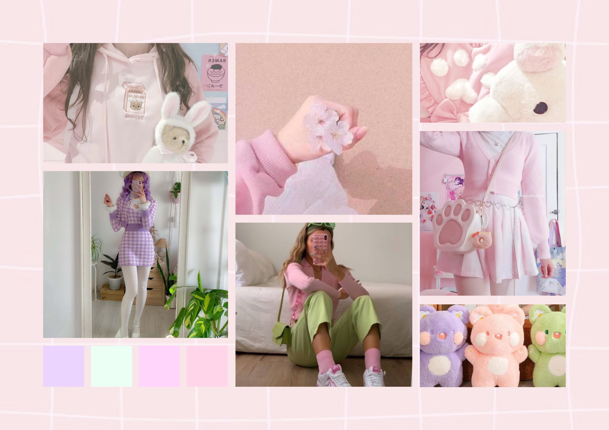{width=100%}

## Dark Academia Aesthetic:
📚 Intellectual Charm: Blazers, turtlenecks, and a love for vintage books.

🕯️ Bookish Ambiance: Imagine candlelit study sessions and profound thoughts.

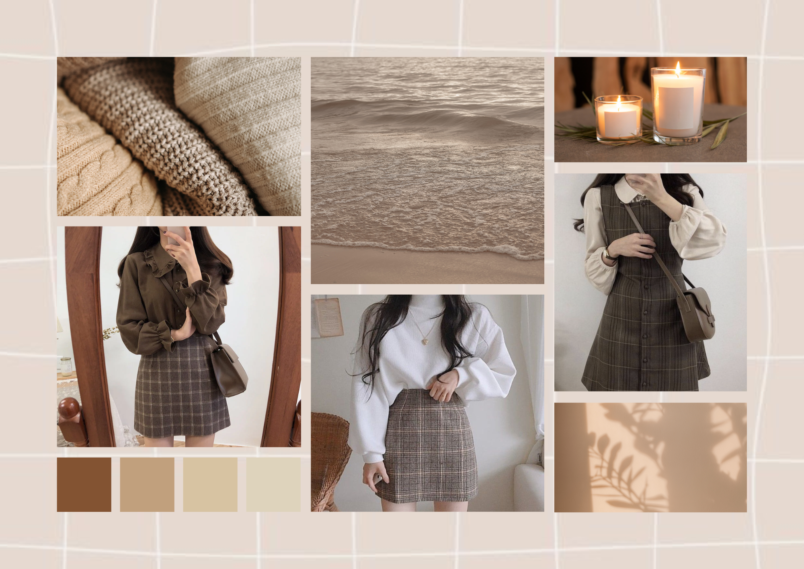{width=100%}

## Kawaii Aesthetic:
👘Cuteness Galore: Pastel colors, plushies, and a sprinkle of joy.

🎈 Spread Positivity: Because life needs more kawaii moments.

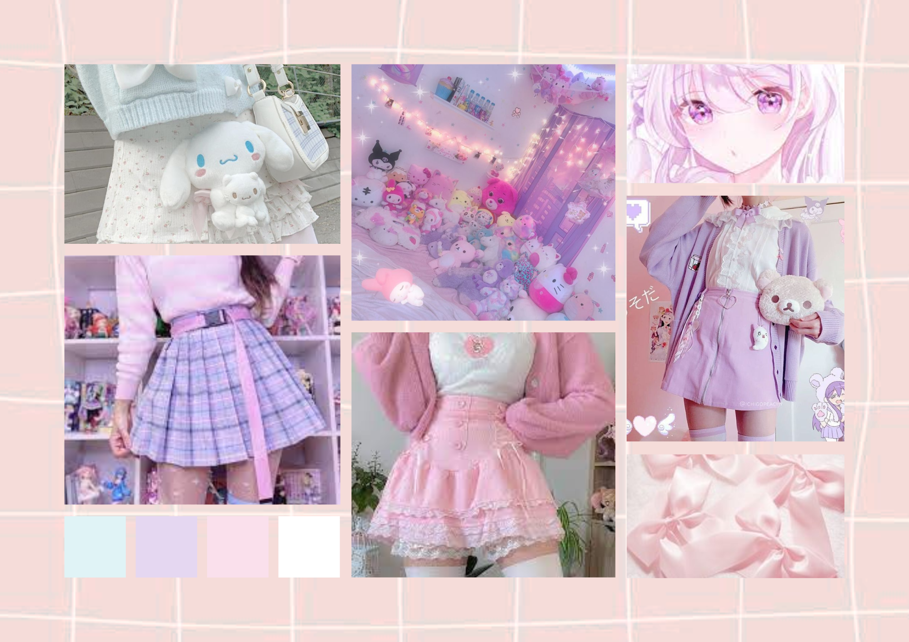{width=100%}

## E-girl Aesthetic:
🖤 Digital Edge: Cyberpunk chic, graphic tees, and neon dreams.

💻 Online Persona: Rule the internet with confidence.

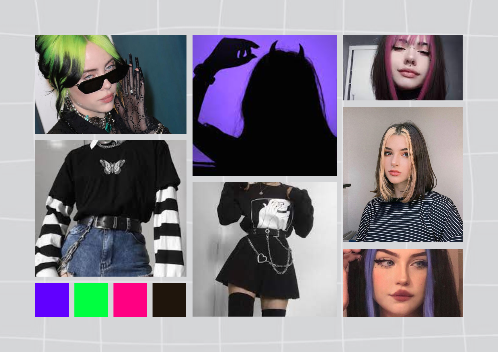{width=100%}

## Fairycore Aesthetic:
🌿 Enchanting Whimsy: Forests, flower crowns, and ethereal dresses.

✨ Nature’s Magic: Where fairies dance under moonlit canopies.

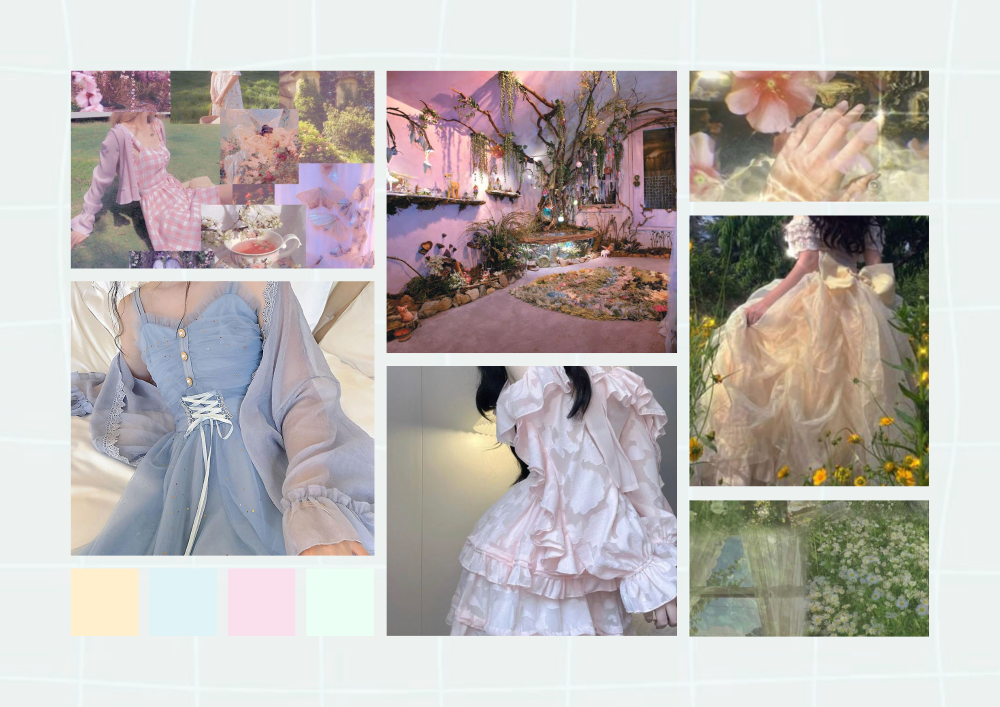{width=100%}

## Preppy Aesthetic:
🎓 Campus Chic: Blazers, pleated skirts, and a dash of sophistication.

🍂 Ivy-Covered Walkways: Academia meets style.

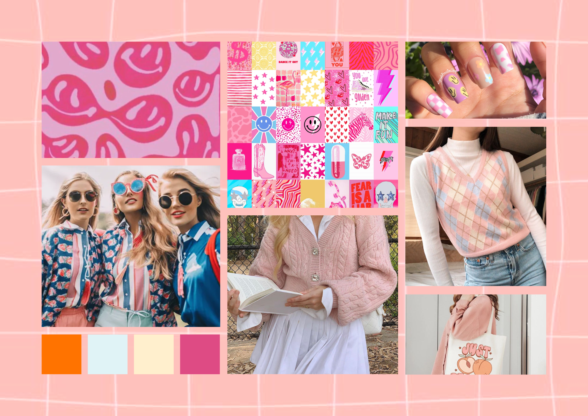{width=100%}

## Casual Aesthetic:
👟 Effortless Comfort: Jeans, hoodies, and weekend-ready vibes.

☕ Cozy Evenings: Because life’s too short for uncomfortable shoes.

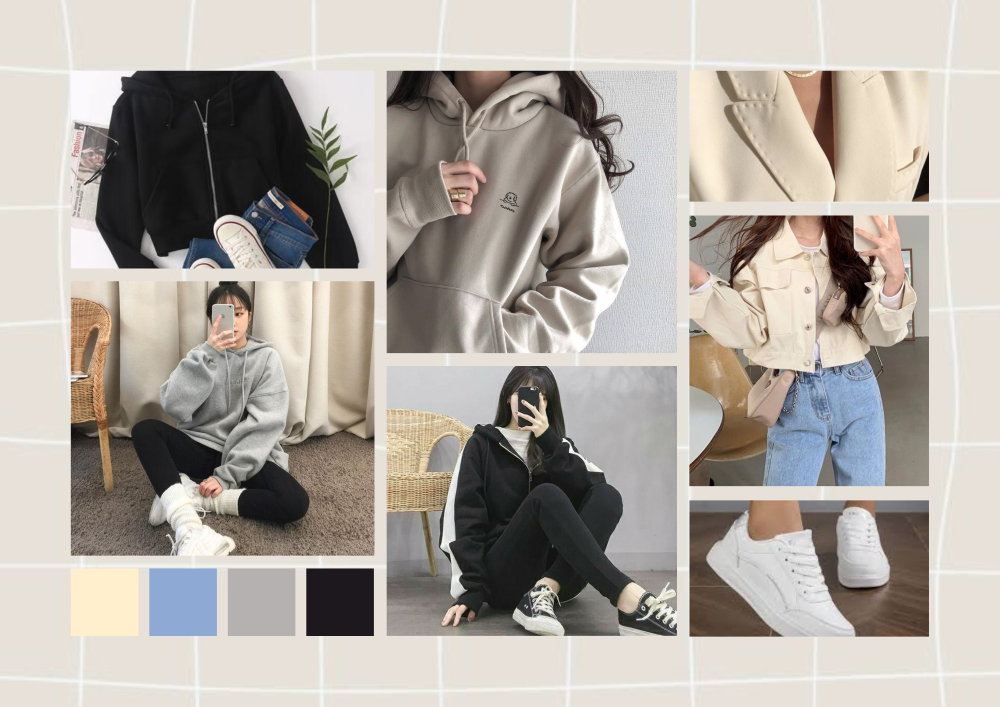{width=100%}

## Minimalist Aesthetic:
🌟 Less Is More: Clean lines, neutral tones, and intentional living.

📦 Quality Essentials: Declutter and embrace simplicity.

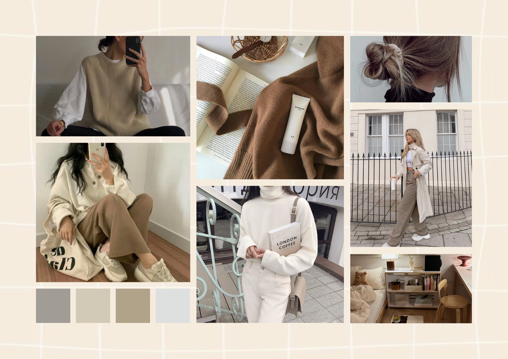{width=100%}

## Cottagecore Aesthetic:
🏡 Enchanting Simplicity: Flowy dresses, straw hats, and imaginary gardens.

☀️ cottagecore is all about cozy warmth and embracing sunshine.

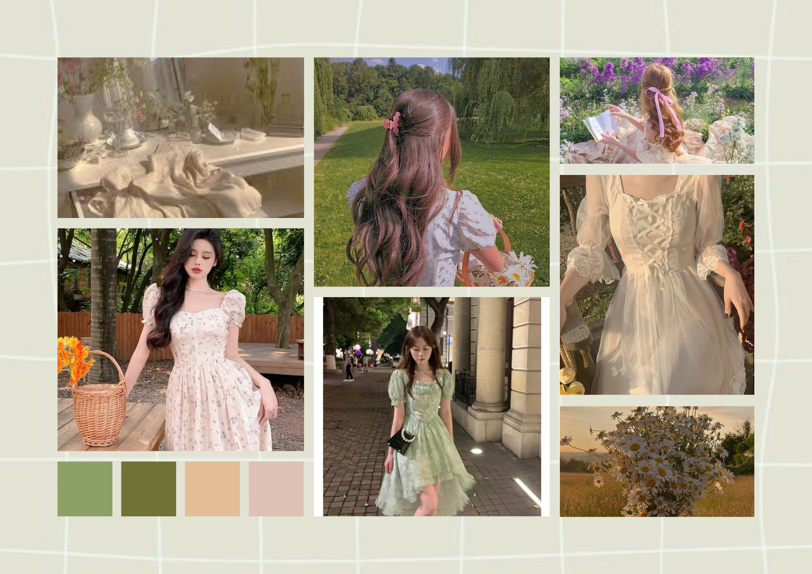{width=100%}

## Princesscore:
🏰 Princess vibes: Think ball gowns, lace, ribbons, and pastel colors. Don’t forget the tiara!

👑 Royal feel: delve into your main character moment!

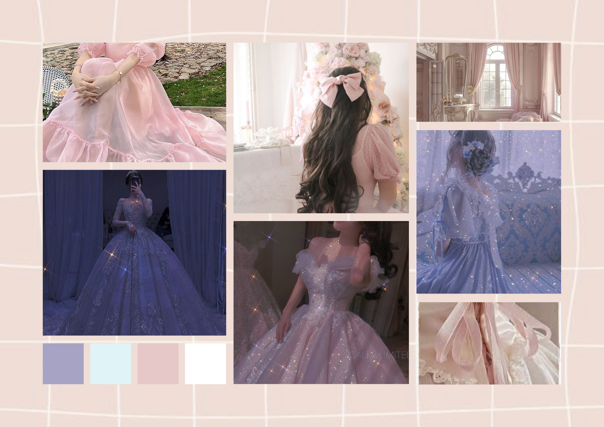{width=100%}

## Streetwear aesthetic
👟🕶️🧢🎒🖤Urban Influence: Graffiti and a bomber jacket and get going carelessly chic!

🌆 City Life: Embrace the hustle and bustle with style and swagger.

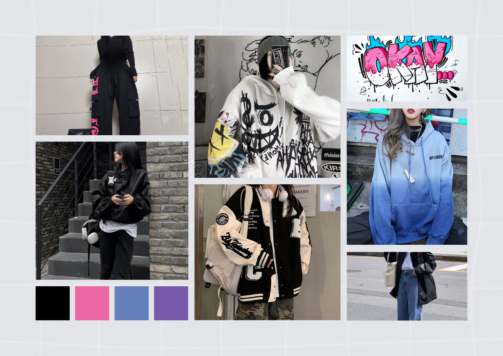{width=100%}

### Have u chosen yet...
Mix, match, and let your inner aesthetic shine! Which vibe speaks to your soul? ✨ 
 
